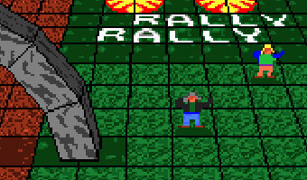
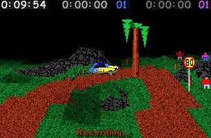
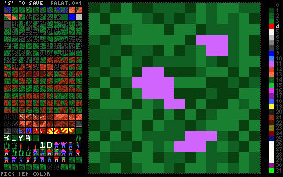
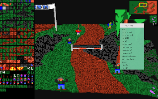
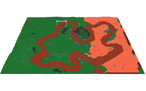

`Note!` This is an umbrella repository for the various projects that make up RallySportED. You'll find links to the individual projects, below.

# RallySportED
RallySportED is a set of tools for modding the cult 1996 DOS game Rally-Sport.

The tools grant you the following powers:
- Create new tracks
- Modify existing tracks
- Edit textures
- Edit the AI
- Alter the game's hard-coded palettes

And they're available for a variety of platforms:
- DOS
- Linux
- Windows (95 through 10)
- Browsers (Chrome, Firefox, Opera, ...)

At the moment, RallySportED provides exclusive support for the demo version of Rally-Sport, which you can find online and also bundled with the binary distributions of RallySportED. The full commercial release of the game is not supported, at this time (generally speaking, the commercial release adds a couple of tracks, fixes a few bugs, and introduces split-screen support, but is otherwise the same as the demo version).

<table>
    <tr>
        <td align="center"></td>
        <td align="center"></td>
        <td align="center"></td>
        <td align="center"></td> 
    </tr>
</table>

# The toolset
**[RallySportED for DOS](../../../rallysported-dos)**\
Track, texture, and AI editors for DOS. These tools can be run on 386/486-class machines. Written in assembly and C++.

**[RallySportED for browsers](../../../rallysported-js)**\
Track editor for browsers. Written in JavaScript.

**[RallySportED for desktops](../../../rallysported-diverse)**\
Track and texture editors for Linux and Windows (95 and up). Includes 3d acceleration through OpenGL and Glide; supports Qt and the Win32 API. Written in C++.

**[SETPAL](../../../rallysported-setpal)**\
A small DOS utility for modifying Rally-Sport's hard-coded palettes. Written in C.

# Content made with RallySportED

You can find tracks made with RallySportED under the [modded-content/tracks/](modded-content/tracks/) directory.

Or visit [http://www.tarpeeksihyvaesoft.com/rallysported/track-list/](http://www.tarpeeksihyvaesoft.com/rallysported/track-list/) for a web version of the track listing.